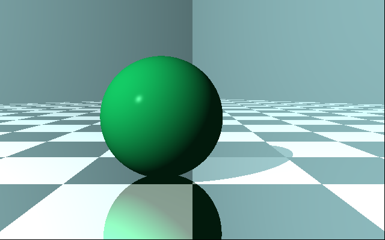

This code adds some quality of life inprovements over the previous code
base
* modified the printing of vectors, points and matricies so that values 
less than EPSILON are now shown as zero.

Chapter 11 adds reflection and refraction support to objects.  This is 
done by adding additional components to the material class.

The following image is produced with no reflection or refraction enabled.

With reflections turn on (the floor is now reflective) we have

